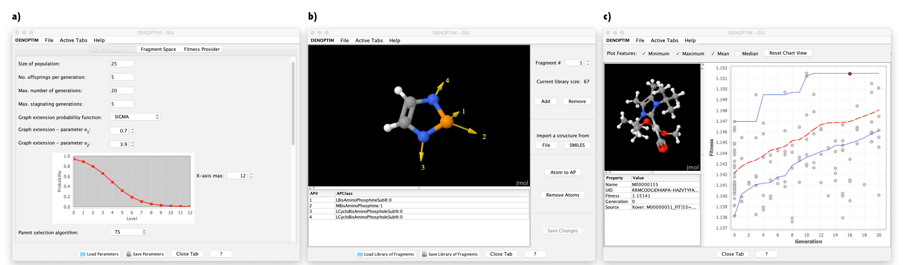

# DENOPTIM

## Introduction
DENOPTIM (De Novo OPTimization of In/organic Molecules) is a software meant for <i>de novo</i> design and virtual screening of functional compounds. In practice, DENOPTIM builds chemical entities by assembling building blocks (i.e., fragments), analyzes each chemical entity as to produce its figure of merit (i.e., fitness), and designs new entities based on the properties of known entities.

DENOPTIM is cross-platform, i.e., runs on Windows, Linux, and MacOS, and comes with a simple graphical user interface, i.e., the GUI. However, computationally demanding molecular design jobs, which we call <i>DENOPTIM experiments</i>, are typically run in the background, as batch processes. Yet, the GUI allows to create input files for such DENOPTIM experiments (Figure 1a), in addition to visualize and edit molecular fragments (Figure 1b) and other DENOPTIM's data structures, and, finally, inspect the output produced by DENOPTIM experiments (Figure 1c).

## Usage
### Graphical User Interface
The graphical user interface (GUI) of DENOPTIM facilitates the preparation and analysis of DENOPTIM experiments. After building the DENOPTIM package (see [Installation](#installation)), the GUI can be launched by double-click on the <code>$DENOPTIM_HOME/build/DENOPTIM-GUI.jar</code> (Win/Mac/Linux) file or using the following command (Mac/Linux):

    java -jar $DENOPTIM_HOME/build/DENOPTIM-GUI.jar
    
where <code>$DENOPTIM_HOME</code> is the folder you have downloaded/cloned the DENOPTIM distribution.

### Command Line Programs (Mac/Linux)
DENOPTIM programs are typically run using the following command

    java -jar <program.jar> <input_parameters>

where <code>&lt;program.jar&gt;</code> is the JAR file of the program you what to run, for instance <code>DenoptimGA.jar</code> for the the genetic algorithm, or <code>DenoptimCG.jar</code> for the 3D-structure builder, or <code>FragSpaceExplorer.jar</code> for the virtual screening tool, and <code>&lt;input_parameters&gt;</code> is a text file containing [parameters and keywords](https://htmlpreview.github.io/?https://github.com/denoptim-project/DENOPTIM/blob/master/doc/user_manual.html#Toc35546_1191730726).
Complete examples of DENOPTIM experiments running the genetic algorithm or the virtual screening tool can be found under the test folder at [test/PtCOLX2](./test/PtCOLX2) and [test/PtCOLX2_FSE](./test/PtCOLX2_FSE) respectively.

## User Manual
The complete user manual is available under the <code>doc</code> folder and is accessible [on line](http://htmlpreview.github.com/?https://github.com/denoptim-project/DENOPTIM/blob/master/doc/user_manual.html)

## Content of the source code folder tree

* [build](./build): contains scripts for building the DENOPTIM package from source.

* [contrib](./contrib): contains additional source and data that may be used in relation to DENOPTIM

* [doc](./doc): contains documentation and user manual

* [lib](./lib): The lib directory contains all third-party libraries used by DENOPTIM.

* [src](./src): contains the source code of DENOPTIM's core and modules:

  * DENOPTIM: Generic library of functions and data structures.

  * DenoptimCG: Generator of 3D conformations.

  * DenoptimGA: Genetic algorithm engine that uses the DENOPTIM library for molecular design.

  * DenoptimRND: Dummy evolutionary algorithm using only random selection of new members (no genetic operators).

  * FragSpaceExplorer: Combinatorial algorithm for exploration of fragment spaces.
  
  * GUI: the user-friendly graphical interface.

  * misc: miscellaneous utilities that may be useful in DENOPTIM-based work.

* [test](./test): contains some automated functionality tests and the published test case.

## Installation 
PREREQUISITE: To install DENOPTIM you need Java JDK version 1.8. You can get and install Java from www.oracle.com, https://adoptopenjdk.net, or https://openjdk.java.net/.

### Installation (Windows)
Building DENOPTIM in Windows is currently supported only for the GUI and requires Eclipse IDE (https://www.eclipse.org/). Download the latest release and import the DENOPTIM Java project. You can then run DENOPTIM's GUI as a Java application.

### Installation (Linux/MacOS)
1. Check the prerequisite. If the following does not result in version statements or the version is not 1.8.xxx, you should get and install Java from www.oracle.com, https://adoptopenjdk.net, or http://openjdk.java.net/:

        java -version
        javac -version

2. Download the released version that you want to use (from the [releases](https://github.com/denoptim-project/DENOPTIM/releases) tab) or download/clone this GitHub repository (use the green "Clone or download" button). From now on, we assume that <code>$DENOPTIM_HOME</code> is the uncompressed folder you have downloaded/cloned into your local computer. 

3. Compile DENOPTIM and all its accessories with the following commands:  

        cd $DENOPTIM_HOME/build
        bash build-all.sh

4. Done! The DENOPTIM package is ready. 

#### Testing (Linux/MacOS)
After compilation you can run the functionality tests (takes ca. 5-10 minutes).

    cd $DENOPTIM_HOME/test/functional_tests
    bash runAllTests.sh

The tests will use a temporary folder <code>/tmp/denoptim_test</code> where you can find all files related to these tests.

In addition, you can play with the optimization of organometallic ligands sets that weaken the carbonyl bond in Pt(CO)(L)(X)2 complexes (takes 10-15 minutes).

    cd $DENOPTIM_HOME/test/PtCOLX2
    bash runEvolutionaryExperiment.sh

This will create a playground folder at <code>/tmp/denoptim_PtCO</code> where the evolutionary experiment will be run. Once the experiment is completed, you'll find also the results in the same folder.

An analogous test can be run with the fragment space explorer, i.e., a combinatorial, systematic exploration of the fragment space.

    cd $DENOPTIM_HOME/test/PtCOLX2_FSE
    bash runCombinatorialExperiment.sh

## Contributing
Open an issue to point out any unreported and unexpected behaviors, bugs, or just to discuss changes to code or documentation. To make actual changes to the code follow the [git workflow](https://guides.github.com/introduction/flow/) practices as indicated in file  [CONTRIBUTING.md](./CONTRIBUTING.md).

## License
DENOPTIM is licensed under the terms of the GNU Affero GPL version 3.0 license. 
Instead, libraries used by DENOPTIM programs are licensed according to their respective licenses:
* cdk: GNU Lesser GPL Version 2.1
* commons-cli: Apache License Version 2.0
* commons-io: Apache License Version 2.0
* commons-lang3: Apache License Version 2.0
* commons-math3: Apache License Version 2.0
* vecmath: GNU General Public License Version 2
* Jmol: GNU Lesser General Public License 2.0
* apiguardian: Apache License Version 2.0
* jfreechart: GNU Lesser General Public License 2.1
* graphstream: GNU Lesser General Public License 3.0
* junit: Eclipse Public License 2.0
* javax.servlet: CDDL 1.1

## Cite DENOPTIM
1) DENOPTIM: Software for Computational de Novo Design of Organic and Inorganic Molecules; Marco Foscato, Vishwesh Venkatraman, and Vidar R. Jensen, <i>J. Chem. Inf. Model</i>, <b>2019</b>, 59, 10, 4077-4082 (<a href="https://doi.org/10.1021/acs.jcim.9b00516">https://doi.org/10.1021/acs.jcim.9b00516</a>)
2) Foscato, M.; Occhipinti, G.; Venkatraman, V.; Alsberg, B. K.; Jensen, V. R.; Automated Design of Realistic Organometallic, Molecules from Fragments; <i>J. Chem. Inf. Model.</i> <b>2014</b>, 54, 767–780.
3) Foscato, M.; Venkatraman, V.; Occhipinti, G.; Alsberg, B. K.; Jensen, V. R.; Automated Building of Organometallic Complexes from 3D Fragments; <i>J. Chem. Inf. Model.</i> <b>2014</b>, 54, 1919–1931.
4) Foscato, M.; Houghton, B. J.; Occhipinti, G.; Deeth, R. J.; Jensen, V. R.; Ring Closure To Form Metal Chelates in 3D Fragment-Based de Novo Design. <i>J. Chem. Inf. Model.</i> <b>2015</b>, 55, 1844-1856.

## Acknowledgments
The Research Council of Norway (RCN) is acknowledged for financial support. 
