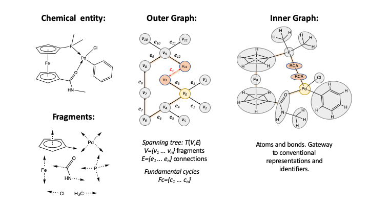
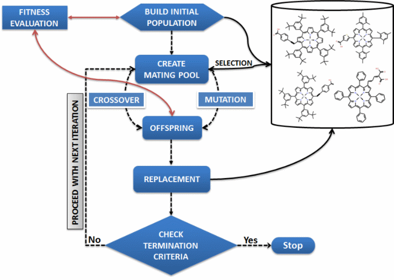

# DENOPTIM
_De novo_ Optimization of In/organic Molecules  
_Version 4.4.1, September 2025_


[TOC]


# About DENOPTIM

DENOPTIM is an open source software suite for the _de novo_ design of chemical entities. The name _DENOPTIM_ stands for  '_De novo_ Optimization of In/organic Molecules' and wants to highlight that DENOPTIM is designed to handle chemical entities way beyond the strict formalisms of organic chemistry (i.e., valence rules). In fact, the development of DENOPTIM started in [2012](https://doi.org/10.1021/ja300865u) as a response to the need of designing transition metal complexes and organometallic catalysts that cannot even be represented unambiguously by standard chemical representations (e.g., multi-hapto metal-ligand complexes, ion pairs, highly reactive catalyst intermediates).

## How To Cite

Please cite [_J. Chem. Inf. Model._ **2019**, 59, 10, 4077–4082](https://doi.org/10.1021/acs.jcim.9b00516)

## Documentation

You are now reading the user's manual, which provides information on how to install and use DENOPTIM. Technical documentation on the software architecture and logic is available in the [developer's manual](developer_manual.md). The latter includes also the JavaDoc and links to the source code.

* * *

# Installation


## Install From Conda (recommended)

DENOPTIM can be installed on using Conda package manager from the command line on Linux/MacOS. On Windows this can be done on the Anaconda prompt or by using [Git Bash](https://gitforwindows.org/) terminal. DENOPTIM is available on two channels: [conda-forge](https://anaconda.org/conda-forge/denoptim), and the channel of the [denoptim-project](https://anaconda.org/denoptim-project/denoptim). So, to install run either of the following commands:
```
conda install -c conda-forge denoptim
```
or
```
conda install -c denoptim-project denoptim
```
You should now have the `denoptim` command available. Run the following and verify you get a help message:
```
denoptim -h
```
The installation from conda has been completed.

## Build From Source

DENOPTIM can be built from source using [Maven](https://maven.apache.org/).

First, download the [latest release](https://github.com/denoptim-project/DENOPTIM/releases/latest). This is more than enough for regular users. However, if you are after developing the DENOPTIM code then fork the repository and work with git.

Extract the zip/tar.gz archive you have downloaded to generate a folder we'll call `DENOPTIM_HOME`. In the following, remember to replace `$DENOPTIM_HOME` with the pathname of the extracted DENOPTIM's distribution folder on your system.

Make sure you have an environment that includes JAVA and Maven. Such environment can be created by manual installation of both JAVA and Maven, or it can be created using conda:
```
cd $DENOPTIM_HOME
conda env create -f environment.yml
conda activate dnp_devel
```
Verify the requirements by running the two commands: Both should return a message declaring the respective versions.
```
javac -version
mvn -version
```
Now, you can build DENOPTIM with
```
mvn package
```
Once maven has finished, you can create call DENOPTIM using a command like the following (NB: replace $DENOPTIM_HOME and ${VERSION} as with the values that apply to your installation):

On Linux/Mac and GitBash on Windows:
```
java -jar $DENOPTIM_HOME/target/denoptim-${VERSION}-jar-with-dependencies.jar
```
On Windows Anaconda prompt:
```
java -jar $DENOPTIM_HOME\target\denoptim-${VERSION}-jar-with-dependencies.jar
```
The installation from source has been completed.


* * *
# Introduction to DENOPTIM

## Representation of Chemical Entities

### Graphs

DENOPTIM perceives chemical entities as graphs (outer graph in Figure 1): Graphs are collections of vertices and edges. Vertices and edges are organized in a spanning tree (T), which is acyclic by definition, and a set of fundamental cycles (Fc). The latter set defined the chords: edges that do not belong to the spanning tree and that define cycles of vertices.



### Vertices

Vertices are abstract objects: graph's building blocks that are decorated with attachment points (AP, the arrows in Figure 1). One attachment points represent the possibility to form one connection with one other vertex.

Vertices come in three forms:

*   **Molecular fragment**: chemical building blocks containing one or more atoms and bonds. Molecular fragments define the relation between attachment point on the vertex and atoms contained in the vertex, thus allowing, if needed, to represent open valences on molecular fragments as attachment points on vertices. However, attachment points do not need to represent a given valence. The content of a molecular fragment vertex is constant.
*   **Template**: vertices that embed a graph. The attachment points on a template vertex, if any, are the reflection of the attachment points of vertices belonging to the embedded graph that are not used to made connections in such embedded graph. The structure of the embedded graph's spanning tree and the identify of each vertex may be fixed, in which case the template is a container for a constant sub-graph, or may be editable allowing, for instance, to alter the embedded graph while retaining the structure defined by the template.
*   **Empty vertices**: can contain properties in any form, but do not contain atoms or embedded graphs. Empty vertices are best interpreted as either property carriers or place-holding vertices.

Independently on their nature, vertices are further classified according to their role as building blocks. There are three roles for vertices:

*   __scaffolds__ are vertices used only to start the construction of a graph and are the only kind of vertex that can be used for this purpose. In fact, the scaffold is always the seed of the spanning trees of automatically built graphs. This role is often granted to a chemically critical building block, for example the metal center in a transition metal complex.
*   __fragments__ are vertices that can be used freely in the construction of a graph, but cannot be used to start a new graph. This is the regular role for most building blocks.
*   __capping groups__ are vertices that have only one attachment point and are used to stop the grow of a chain of vertices, typically to saturate open valences (see Capping procedure, below).

### Edges

Edges represent an abstract relation between vertices. An edge is the connection between two attachment points. Edges are often the reflection of chemical bonds, pseudo-bond, spatial or relational information.

### Attachment Points and Attachment Point Class

Attachment points are owned by vertices and represent the possibility of that specific vertex to form a connection, i.e., one edge, with one attachment point that is owned by another vertex. Attachment points can be decorated with information defining i) the atoms that hold an open valence (if any), ii) the spatial arrangement of the connected vertex in relation to the vertex holding the attachment point, and iii) a label used to classify the attachment points.

The latter property, the label, is a string with no spaces specifying the so-called __class of the attachment point__ (or attachment point class), APClass. The APClass can be defined also by the user (e.g., via the GUI) as long as it adheres to the following syntax.

`<string>:<int>`

where

*   `string` is an alphanumeric string, and
*   `int` is a positive integer number.

This syntax is best explain by providing an example of how molecular fragment can be generated from whole molecules. In particular, we consider our own fragmentation algorithm (see [_J. Chem. Inf. Model._ **2014**, 54, 3, 767–780](https://doi.org/10.1021/ci4007497)), which is implemented in the program [Fragmenter](#Fragmenter). This fragmentation algorithm uses cutting rules to identify the bond to break in order to generate fragments. For each broken bond two attachment points are generated (one on each side of the broken bond) and, in order to distinguish between the two sides of the broken bond, these attachment points are given two complementary APClasses. These APClasses share a common part (the reference to the cutting rule) and have an additional suffix that makes them distinguishable. For example, if the cutting rule is named `myCuttingRule`, the two APs will have APClass `myCuttingRule:0` and `myCuttingRule:1`.

Notably, APClasses are a way to encode the chemical environment of a the two sides of a bond that was broken to generate a pair of attachment points. Conversely, this encoded information on chemical environment can be exploited to control how attachment points are best combined to form vertex-vertex connections. In particular, while APClasses can be used to rebuild only the types of connections that were originally broken in the fragmentation procedure, they also allow to introduce compatibilities across different APClasses. To this end, DENOPTIM uses a so-called Compatibility Matrix (see below) to define which combinations of APClasses are to be considered as compatible when building or editing graph by attaching or replacing vertices.

The construction and editing of graphs is thus controlled by the APClass compatibilities and independent from valence rules. This allows to define a completely customizable set of rules for building any kind of entity, including models of disconnected systems, active species and transition states. However, in order to make sure that the entities built this way are valid chemical entities, an additional procedure in needed to saturate the free attachment points that, if left unused, would result in unwanted open valences. This procedure is called "capping" and it adds "capping groups" (see above) on specifically defined free attachment points.

The use of capping groups is particularly useful when standard “hydrogenation” routine (i.e., addition of H to every open valence) is expected to fail. This occurs when the chemical entities under construction are not standard organic molecules similar to those for which “hydrogenation” tools have been trained.

The settings of the capping procedure define the list of APClasses that need to be capped, and the APClasses of the capping groups to use for each of the APClasses that need capping. These settings are part of the Compatibility Matrix file (see below).

### Symmetry

DENOPTIM can repeat any graph operation on sets of APs that are related by high degree of topological similarity. APs are considered symmetric when they have

*   same attachment point class,
*   same element as the AP’s source atom (if any),
*   same type and number of bonds connected to the source atom (if any),
*   same element and number of atoms connected to the source atom (if any).

Users can control the probability of symmetric operations on specific APClasses and include symmetry constraints also based on APClasses (see keywords section, below).

## Evaluation of Chemical Entities: Fitness Evaluation {#FitnessEvaluation}

The design of functional chemical entities depends on the capability of evaluating how candidate entities are fit for a given purpose: the evaluation of the fitness. In DENOPTIM, such evaluation aims to associate the internal representation of a chemical entity, i.e., a graph, with a numerical value, i.e., the fitness. For the sake of generality, DENOPTIM does not take any assumption as to how the fitness is calculated, but it assumes that a "fitness provider" is defined for the purpose of evaluating the fitness of each candidate.

Fitness providers can be of two types:

*   internal fitness provider: it's DENOPTIM's code that is executed within the DENOPTIM virtual machine to calculate descriptors from chemical representation that are built on-the-fly for each chemical entity from its graph representation. The descriptors are then combined into a numerical fitness value according to an equation that must be defined in the input. The internal fitness provider does not perform any molecular modeling, such as geometry optimization and the like.
*   external fitness provider: it's a software external to DENOPTIM, that DENOPTIM runs as a sub-process to compute the fitness of a chemical entity. Any `bash` or `python` script can be executed as an external fitness provider. An external fitness provider is expected to do the following tasks:

    1.  Read the input defining the entity to evaluate from an [SDF file produced by DENOPTIM](#CandidateChemicalEntityFiles).
    2.  Perform any molecular modeling tasks, including, for example, 3D model construction, property calculations, output file parsing, and post processing.
    3.  Calculate the fitness value from the results of the molecular modeling tasks.
    4.  Create an output SDF file (see [Fitness Files](#FitnessFiles)) for storing the fitness value of the candidate entity (or a properly formatted error message) in addition to any useful output data that might be used to post-process the results.

    When DENOPTIM algorithms are asked to use an external fitness provider, they execute such task, wait for completion, and retrieve the final results from the [output fitness file](#FitnessFiles). Note that DENOPTIM programs do not interact with the running script.

* * *

# DENOPTIM Programs {#Programs}

## Graphical User Interface

The graphical user interface (GUI) is the main interface used for preparing and inspecting DENOPTIM files and experiments. To launch the GUI, you can chose one of the following:

*   if you installed via conda (recommended), you can run the command following command.
```
denoptim
```
*   alternatively, double click on the `denoptim-${PKG_VERSION}-jar-with-dependencies.jar` file, the location of which depends on how you have installed DENOPTIM: this file will be under `target` subfolder of the DENOPTIM distribution folder (the folder downloaded to install the release) if you have built DENOPTIM from source, of it will be under the `${path_to_active_env_location}/lib/` for installation via conda.
*   another alternative is to run the following command, again the `${path_to_denoptim_jar}` depends on how you have installed DENOPTIM (see previous point):
```
java -jar ${path_to_denoptim_jar}/denoptim-${PKG_VERSION}-jar-with-dependencies.jar
```

For installation via conda, remember to activate the appropriate conda environment before issuing any of the above command.

The GUI provides instruction to itself in the form of tool tip messages (hold the cursor still over a button or plot to get a short message explaining what is the functionality of that component) and question-mark-buttons ("?") that can be clicked to display more detailed instructions.

The GUI can be used to open files directly from the command line:
```
denoptim path/to/file1 path/to/file2 path/to/file3
```
The above command will open the three files if their format is recognized as one of the file formats DENOPTIM's gui can open. These include:

*   SDF and JSON files containing vertices, graphs or candidate entities
*   text files containing list of [Keywords and values](#Keywords) (i.e., input parameter files) and [Compatibility Matrix file](#CompatibilityMatrixfile).
*   folders containing the results of denovo and combinatorial design (see [GA Output](#GARunOutput) and [FragSpaceExplorer Output](#FragSpaceExplorerOutput) respectively)

Finally, the GUI offers also the possibility to configure and run de novo design and virtual screening experiments that can otherwise be run by background processes as explained below. The threads executing GUI-controlled experiments are fully dependent on the GUI, and will be terminated upon closure of the GUI (the user receives a warning, in such cases).

## Genetic Algorithm Runner

De novo design driven by a genetic algorithm using graphs as genome for chemical entities. The overall schematic of the genetic algorithm (GA) is shown in Figure 3. The algorithm begins with a population of candidates that can be given as input or generated from scratch. Next, a given number of generations are created by producing new offspring either from application of the genetic operators, or by building new entities from scratch.  





### Genetic Operations

Genetic operations are meant to generate graph from scratch (i.e., construction operator), from one parent (i.e., mutation operator), or from a pair of parents (i.e., crossover operator). These events all have to respect the APClass compatibility rules that, together with the libraries of building blocks, define the space of graph building blocks (BB Space). In addition, for symmetric graphs, addition or removal of a vertex can be propagated across all sites related by symmetry. Notably, the vertex corresponding to the scaffold is not subject to crossover or mutation.

The construction operator generates candidates by taking random choices on the scaffold vertex to use as graph seed, on the AP and incoming vertices to use to grow a branch layer-by-layer. The random events are controlled by probabilities setting the likeliness of graph extension events according to graph features such the number of atoms in the corresponding chemical entity and the topological complexity (see [Substitution Probability](#SubstitutionProbability)).

Mutation alters only one graph according to one of the following mutation types:

*   _change branch_: removes a branch of the graph and builds a replacement.
*   _add link_: inserts a vertex in between two previously-connected vertices.
*   _change link_: replaces a non-terminal vertex while retaining the connectivity with downstream branches.
*   _delete link_: removes a non-terminal vertex and reconnects the open ends generated by removal of the original vertex.
*   _delete chain_: removes an entire branch in acyclic graphs or the part of a cyclic graph between two branching points thus opening the ring by removing the bridging chain.
*   _extend_: extends a branch of the graph.
*   _delete_: removes a branch starting from a vertex.

The mutation operator can be configured to perform also multi-site mutations: mutation that can alter a graph more multiple times on possibly independent location and performing independent mutation types.

Crossover involves the swapping of one subgraph from each of the parents to the other parent. The subgraphs to swap (a.k.a. the crossover sites) need not to be terminal (i.e., crossover is not limited to dangling branches) and can be of any size, from a single vertex to an entire branch attached to the scaffold. When template vertices are present in the parent graphs, crossover sites are defined so that the subgraphs to swap belong to graphs that are at the same level of embedding in the recursive template-graph structure of the two parents. Moreover, the subgraphs can include only vertices belonging to the same level of embedding. Finally, while crossover generates two offspring from two parents, only one offspring is considered to be the product of a single crossover event.

### Substitution Probability {#SubstitutionProbability}

The generation of very large graphs or graphs with too many incident edges on a single vertex can be reduced by tuning the so-called substitution probability: the probability of appending a vertex on to a free AP. The substitution probability (<i>P</i>) results from the product of two components: the growth probability (<i>P<sub>g</sub></i>), and the crowding probability (<i>P<sub>c</sub></i>). The growth probability (<i>P<sub>g</sub></i>) limits the growth of an entity. This limit can be expressed in terms of graph deepness (i.e., using the _level_ of a vertex to determine the likeliness of further graph extension on that vertex, see Figure 4) or in terms of molecular size (i.e., number of heavy atoms, irrespectively of graph size).


To illustrate, vertex 1 in Figure 4 is the scaffold vertex (i.e., represented by a red square) and is in level -1 (<i>L<sub>-1</sub></i>), vertexes 2 (normal vertex represented by blue square), 3 (another normal vertex), and 5 (a capping group represented by a green square) are at level 0 (<i>L<sub>-0</sub></i>), and so on.


The __growth probability__ can be controlled by one of the following schemes (where _L_ is either the vertex _level_ or the number of heavy atoms):

*   **EXP_DIFF**: Given a growth multiplier factor _λ_, the probability of addition is given by  

     \f$ \large p = \frac {1 - e^{(-L\lambda)}}{1 + e^{(-L\lambda)}}  \f$

*   **TANH**: Given a growth multiplier factor _λ_, the probability of addition is determined by   

    \f$ \large p = 1 - tanh(\lambda L) \f$

*   **SIGMA**: This scheme is based on two factors \f$σ_1\f$ (the steepness of the function where the probability is 50%) and \f$σ_2\f$ (the value of _L_ where the probability is 50%), and calculates the probability as   

    \f$ \large p = 1 - \frac {1}{1 + e^{(-\sigma_1(L -\sigma_2)}} \f$

*   **UNRESTRICTED**: This scheme allows for unrestricted growth (_p = 1_ at all levels).

The **crowding probability** is meant to reduce the likeliness of adding incident edges to a vertex that is already using one or more APs rooted on the same source atom that holds the AP for which we are evaluating the substitution probability. Practically, for a free AP (<i>APi</i>) we define the _crowdedness_ (<i>C<sub>APi</sub></i>) as the number of non-free APs that are rooted on the same source atom holding (<i>APi</i>).

For example, we consider vertex 3 in Figure 4 (i.e., the blue square at the center of the figure), and assume that the molecular representation of this vertex consists of a single atom holding four attachment points. To calculate the crowdedness of <i>AP2</i> (i.e., the yellow circle located below the blue square representing vertex 3) we count the number of APs that i) share the same source atom of <i>AP2</i>, and ii) are used to form edges with vertices that are not capping groups. While condition _i_ is satisfied by all four APs of the vertex, only two APs satisfy condition _ii_. The crowdedness of <i>AP2</i> is thus <i>C<sub>APi</sub></i> = 2.

The crowding probability for <i>APi</i> is then calculated using the crowdedness <i>C<sub>APi</sub></i> according to any of the schemes presented above (**EXP_DIFF**, **TANH**, **SIGMA**, **UNRESTRICTED**) using <i>C<sub>APi</sub></i> in place of _L_.

### Parents Selection Strategies

An important aspect of any evolutionary algorithm is that of selection of the best set of individuals (chromosomes) for the next generation. It is also essential to maintain enough diversity in the genetic material so that the solution/chemical space is sufficiently covered. In DENOPTIM the following selection strategies are available:

*   **Random**: In this scheme, chromosomes are randomly selected.
*   **Tournament (TS)**: In this scheme, a group of size n (typically 2) is randomly chosen from the current population. The fittest from the group is then added to the mating pool.
*   **RouletteWheel (RW)**: In this sampling scheme, each chromosome is assigned a portion/slice of the roulette wheel, the area of the portion being proportional to its fitness. The wheel is then spun a number of times and the chromosome corresponding to the slice that comes under the wheel marker is added to the pool.
*   **Stochastic universal sampling (SUS)**: differs from RW in that it uses _N_ (number of selections required) equally spaced pointers. The population is shuffled randomly and a single random number _r_ in the range [0, 1] is generated. The _N_ individuals are then chosen by generating the _N_ pointers, starting with _r_ and spaced by _1_, and selecting the individuals whose fitness spans the positions of the pointers. Because the individuals are selected entirely based on their positions in the population and with only one randomly generated number, SUS has zero bias.

### GA Parallelization Schemes

Two parallelization schemes based on the consumer-producer pattern have been implemented. In the following, a batch implies a set of jobs, i.e., fitness function evaluations (generally equal to the number of processors available) submitted for parallel execution. The first such scheme (SCH-1) uses a serial batch processing scheme wherein, the subsequent batches can only be submitted on completion of the previous. This implies that while some jobs may be completed sooner than others, the program will still wait for the other submitted tasks to complete before submitting another batch.

To remove this waiting time, the second scheme (SCH-2) enables continuous submission so that new jobs may be launched whenever free threads are available. Notably, a side effect of this scheme is that results from a long running calculation, for e.g. started in `Generation #1`, may only become available in `Generation #20`. In such cases, the evaluated molecule will become part of the population only in generation #20. The fixed generational behavior of the GA is subsequently lost.

### GA Run Input

A GA run can be performed either by defining the input in the GUI and running the experiment from the gui, or by issuing this command:
```
denoptim -r GA input_parameters_file
```
where `input_parameters_file` is a text file collecting the configuration parameters for the GA program. Such file can have any name and contains one input parameter per line. The `#` character is used to denote a comment, and lines starting with this character are not processed. Each input parameter is specified by means of a keyword. The complete list of keywords is available in the [Keywords](#Keywords) section. Examples of input files can be found in the test folder. Note that `input_parameters_file` file can be generated with the GUI from "New Evolutionary De Novo Design" button.

### GA Run Output {#GARunOutput}

The program outputs a number of files during its execution. At the beginning of the execution, the program creates a directory `RUNYYYYMMDDHHMMSS` and a log file `RUNYYYYMMDDHHMMSS.log` that are named according to the date (`YYYYMMDD`) and time (`HHMMSS`). All relevant files generated by DENOPTIN associated with the current run are stored in this folder. Instead, files managed by external fitness provider script are not directly used by the GA runner code and can thus be placed anywhere. Files pertaining to a specific generation are stored in sub-folders `RUNYYYYMMDDHHMMSS/Gen#` (where `#` is the generation number), while the final results of an evolutionary experiment are collected in sub-folder `RUNYYYYMMDDHHMMSS/Final` (see Figure 5).


Once a generation is completed, the software creates a summary of the current population. For instance, the summary for generation `N`, where `N` is an integer number, is available as a TXT file (`GenN/GenN.txt`).

The output from an ongoing or completes GA experiment can be inspected with the GUI:
```
denoptim /path/to/RUNYYYYMMDDHHMMSS
```

### Interacting with Ongoing GA Runs {#GAInteract}

During a GA run the user often desires to intervene with actions altering the course of the experiment. The GARunner runs a command listener that checks for instructions deposited in a dedicated location of the file system. Depending on the instructions found, DENOPTIM will try to perform the corresponding tasks as soon as compatible with the ongoing algorithm. Once an instruction has been found and interpreted by DENOPTIM (this event is reported in the log file), it cannot be undone/overwritten, even if it is still to be performed.

The user can formulate instructions in the form of properly formatted ascii files (i.e., an _intructions_file_) that are deposited under the `RUNYYYYMMDDHHMMSS/interface` folder, i.e., a file-system location that is specific for a single GA run. The _intructions_file_ has effects only on the specific GA run that generated the `RUNYYYYMMDDHHMMSS` folder.

The _intructions_file_ is a text file. The name of any such file is irrelevant: any file will be read irrespectively of its name. Each _intructions_file_ is red line-by-line: each line can be arbitrarily long and will be interpreted as a single instruction. Each line begins with a keyword that defines the kind of instruction. The keyword is separated from the rest of the line by a blank space. After the blank space a variable number of arguments can be given depending on the specific instruction (see below). Currently, the following instructions can be given to DENOPTIM:

*   Terminate the GA experiment. Keyword: `STOP_GA`; Arguments: no further arguments required. Just type the `STOP_GA` keyword.
*   Remove one or more candidate from the current population. Keyword `REMOVE_CANDIDATE` , Arguments: space-separated list of candidate names (e.g., `REMOVE_CANDIDATE M00000028 M00000031` asks to remove both candidates from the population, if they are still in the population).
*   Evaluate one or more manually generated candidates and possibly include them into the population. Keyword `ADD_CANDIDATE`, Arguments: space-separated list of pathnames to files defining the candidate to be added (e.g., `ADD_CANDIDATE /tmp/candidate_1.sdf /tmp/candidate_2.sdf`)

## FragSpaceExplorer

FragSpaceExplorer performs systematic exploration of the fragment space, or, more appropriately, of the space of graph building blocks - BB Space). The tool can be used to visit all the combination of building blocks that can be obtained from a given starting point (i.e., one or more graphs) and a defined BB Space, i.e., an ensemble of building blocks, connection rules and constraints. FragSpaceExplorer can be used for combinatorial approaches, where a number of alternative chemical entities need to be generated and evaluated, and also to enumerate entities or just to appreciate the characteristics of a designed BB Space. For instance, one may want to know how many acceptable chemical entities are encoded in a BB Space one has configured, or the amount of redundancy in such space (i.e., number of different graphs that encode the same chemical entity).

A set of initial graphs (from now on referred as the roots) can be given as input or built from a library of scaffolds. FragSpaceExplorer iterates over all roots and all the combinations of building blocks: vertices of any type, including molecular fragments, capping groups, if any, and the “empty fragment”, which represents the possibility of leaving the AP unused if permitted. Only one vertex is appended on each attachment point, thus each root is coated by vertices layer-by-layer. The graphs generated by adding N layers of vertices belong to the L<sub>N-1</sub> and are used as roots to create the graphs of L<sub>N</sub> (Figure 6).

{html: width=25%, height=25%}


The exploration terminates with the exhaustion of the combinatorial space or with the completion of the maximum allowed level set by the user (see [Keywords](#Keywords)).

All graphs are complete (i.e., no capping groups needed, no forbidden free AP found) and acceptable (i.e., respecting all constraints imposed by the user; for instance max. number of heavy atoms, max. molecular weight, etc.) can be sent to a fitness evaluation task performed by an internal or external fitness provider. For example, the external subtask may include 3D model construction and property evaluation, or calculation of a fitness. Such fitness is recorded for each candidate, but is not used to guide the combinatorial search in any way.

### FragSpaceExplorer Input

A FragSpaceExplorer run (or FSE run) can be performed either by defining the input in the GUI and running the experiment from the gui, or by issuing this command:
```
denoptim -r FSE input_parameters_file
```
where `input_parameters_file` is a text file collecting the configuration parameters for the FragSpaceExplorer program. In particular, the only required input is the [definition of the BB Space](#BBSpace). The `input_parameters_file` file can have any name, and contains one input parameter per line. The `#` character is used to denote a comment and lines starting with this character are not processed. Each input parameter is specified by means of a keyword. The complete list of keywords is available in the [Keywords](#Keywords) section. Examples of input files can be found in the test folder. Note that `input_parameters_file` file can be generated with the GUI from "New Virtual Screening" button.

### FragSpaceExplorer Output {#FragSpaceExplorerOutput}

The output generated by FragSpaceExplorer is structured as the following folder tree:

*   `FSEYYYYMMDDHHMMSS.log` (log file)
*   `FSEYYYYMMDDHHMMSS.chk` (checkpoint file)
*   `FSEYYYYMMDDHHMMSS`
    *   `FSE-Level_-1`
        *   `FSE-Level_-1.txt` list of generated graphs as simplified (human readable) strings.
        *   `dg_1.json` serialized graph representation of chemical entity with graphID=1
        *   `dg_2.json` serialized graph representation of chemical entity with graphID=2
        *   …
    *   … other `FSE-Level-` folders

The output from an ongoing or completes FSE experiment can be inspected with the GUI:
```
denoptim /path/to/FSEYYYYMMDDHHMMSS
```

### Restart FragSpaceExplorer from Checkpoint file

FragSpaceExplorer can be very long, so a checkpoint file is dumped at regular time intervals (by default every N graphs, where N=100; see [Keywords](#Keywords) section) to keep track of where the exploration has arrived and, in case of abrupt termination of the execution, restart the FSE experiment from the checkpoint file. Calculation that were running when the termination occurred or that were submitted after the generation of the checkpoint file are considered to be lost and will be re-submitted upon restart of the FSE run. Therefore, to avoid duplicate the files related to those “lost”, calculations should be collected and isolated.

## Fragmenter {#Fragmenter}

Fragmenter is a program that performs fragmentation of molecules and management of fragments. Fragmentation is based on the application of bond-cutting rules that identify which bonds should be broken (see [_J. Chem. Inf. Model._ **2014**, 54, 3, 767–780](https://doi.org/10.1021/ci4007497)). Each broken bond is replaced by a pair of attachment points: one attachment point on each of the atoms (or pseudoatoms) that were originally bonded. The attachment point class (APClass) on each such attachment points is defined by the string identifying the cutting rule (i.e., the rule name) and an integer that distinguish the two ends of the broken bond. For example, if the cutting rule is named `myCuttingRule`, the two APs will have APClass `myCuttingRule:0` and `myCuttingRule:1`.

Fragmenter can also filter fragments according to criteria based on fragment's molecular formula, number of non-Hydrogen atoms, substructures (by SMARTS), and pool of attachment points. Moreover, graph-isomorphic fragments (i.e., fragments that have the same topological structure of atoms, bonds, and attachment points, but possibly different geometry) can be collected and analyzed by Fragmenter to identify clusters of geometries and extract the most representative geometry for each cluster. Both filtration and clustering are tasks that can be performed during the fragmentation of molecules or in a standalone fashion.

The Fragmenter can be run with this command:
```
denoptim -r FRG input_parameters_file
```
where `input_parameters_file` is a text parameters file with the [keywords](#Keywords) providing all input parameters and settings.

## Molecule-to-graph converter {#Mol2Graph}

While fragmentation is typically meant to generate building blocks, the same mechanism can be used to convert a molecular representation into a graph representation by replacing specific bonds with fragment-fragment connections. 

The Mol2Graph converted can be run with this command:
```
denoptim -r M2G input_parameters_file
```
where `input_parameters_file` is a text parameters file with the [keywords](#Keywords) providing all input parameters and settings.

## Graph Editor

Graph Editor is a program for editing graphs from the command line. This allows embedding a graph edit task in any work flow external to denoptim. For example, in the fitness evaluation work flow of an external provider.

The graph editor can be run with this command:
```
denoptim -r GE input_parameters_file
```
where `input_parameters_file` is a text parameters file with the [keywords](#Keywords) providing all input parameters. Among these settings there is a text-based definition of the graph editing task. See [Graph Editing Task Files](#GraphEditingTaskFiles).

## Genetic Operator

This is a program for performing genetic operations from the command line.

This program can be run with this command:
```
denoptim -r GO input_parameters_file
```
where `input_parameters_file` is a text parameters file with the [Keywords](#Keywords) providing all input parameters.

## Fitness Provider Runner

This is a program to launch a fitness provider (internal or external), in the same way it is done within GA or FSE runs, but straight from the command line.

This program can be run with this command:
```
denoptim -r FIT input_parameters_file
```
where `input_parameters_file` is a text parameters file with the [Keywords](#Keywords) providing all input parameters.

## 3D Molecular Models Builder {#ThreeDBuilder}

This is a program for converting graph representation into a 3D chemical representation by exploring the 3D features of building blocks and, if needed, perform a ring-closing conformational search (see [_J. Chem. Inf. Model._ **2015**, 55, 9 1844-1856](https://doi.org/10.1021/acs.jcim.5b00424)).

This program can be run with this command:
```
denoptim -r B3D input_parameters_file
```
where `input_parameters_file` is a text parameters file with the [Keywords](#Keywords) providing all input parameters.

**WARNING:** This program requires [Tinker Molecular Modeling software](https://dasher.wustl.edu/tinker/) to be installed on the system. The user is responsible for installing Tinker in accordance with its license terms. Furthermore, the ring-closing conformational search requires a customized version of Tinker. Contact [denoptim.project@gmail.com](mailto:denoptim.project@gmail.com) for instructions on how to modify Tinker and use the customized version in accordance with Tinker license's terms.

## Graph Isomorphism Analyzer {#GraphIsomorphism}

This is a program that analyzes graph aiming to detect "DENOPTIM-isomorphism". "DENOPTIM-isomorphic" is a DENOPTIM-specific definition of [graph isomorphism](https://mathworld.wolfram.com/IsomorphicGraphs.html) that differs from the most common meaning of isomorphism in graph theory. In general, graphs are considered undirected when evaluating DENOPTIM-isomorphism. Next, since a graph is effectively a spanning tree (ST<sub>i</sub>={{vertices}, {acyclic edges}}) with a set of fundamental cycles (FC<sub>i</sub>={C<sub>1</sub>, C<sub>2</sub>,...C<sub>n</sub>}), any graph G={ST<sub>i</sub>,FC<sub>i</sub>} that contains one or more cycles can be represented in multiple ways, G={ST<sub>j</sub>,FC<sub>j</sub>} or G={ST<sub>k</sub>,FC<sub>k</sub>}, that differ by the position of the chord/s and by the corresponding pair of ring-closing vertices between each chord defined. The DENOPTIM-isomorphism for two graphs G1 and G2 is given by the common graph theory isomorphism between two undirected graphs U1 and U2 built respectively from G1 and G2.

Finally,

*   vertices are compared excluding their vertex ID,
*   edges are considered undirected and compared considering the bond type they declare and the identity of the attachment points connected thereby. This latter point has an important implication: two apparently equal graphs (same vertices that are connected to each other forming the same vertex-chains) can be non-isomorphic when the APs used to connect two vertices are not the same. Chemically, this means the stereochemistry around one or both vertices, is different in the two graphs. Therefore two otherwise equal-looking graphs can very well be, de facto, not DENOPTIM-isomorphic.

This method makes use of the Vento-Foggia VF2 algorithm (see [DOI:10.1109/TPAMI.2004.75](http://ieeexplore.ieee.org/xpl/articleDetails.jsp?arnumber=1323804)) as implemented in [JGraphT](https://jgrapht.org/).

**WARNING:** Detection of isomorphism can be very slow for pathological cases and for graphs with large symmetric systems!

The Graph Isomorphism Analyzer program can be run with this command:
```
denoptim -r GI input_parameters_file
```
where `input_parameters_file` is a text parameters file with the [Keywords](#Keywords) providing all input parameters.

## Graph List Comparator

This program compares lists of graphs seeking for "DENOPTIM-isomorphic" graphs (see [here](#GraphIsomorphism) for the definition of "DENOPTIM-isomorphic").

This program can be run with this command:
```
denoptim -r CGL input_parameters_file
```
where `input_parameters_file` is a text parameters file with the [Keywords](#Keywords) providing all input parameters.

## Python Gateway Server

This server, which exploits [Py4J](https://www.py4j.org/) functionality,
allows to use DENOPTIM from Python. After starting the server, files containing
DENOPTIM-like data, such as, vertexes, graphs, and molecular representations,
can be read in Python to produce Python objects that offer most of the
functionality used within DENOPTIM.  

Here is a typical workflow for analyzing DENOPTIM data with Python:

1. Start the Python Gateway Server:
```
denoptim -r PY4J
```

   This will hold the shell until the server is no longer needed and the user
   kills the server, for example with `ctrl+C`.
2. While the server is running, start Python and create a client gateway that reads data from a   file, for example, `my_file_with_a_graph.sdf`:
```
from py4j.java_gateway import JavaGateway  
gateway = JavaGateway()  
data = gateway.entry_point.loadData("my_file_with_a_graph.sdf")
```
3. Now `data` contains the graph imported from the file. From now, the content of `data` can be manipulated in Python as any other python object. To see what you can do with it, type `data.` and hit `<tab>`. This generates the list of methods that can be called. For example, `data.getGraphId()` return the identifier of the graph stored in the file (i.e., the integer 123 in the example below).
```
>>> data.getGraphId()
123
```


# Keywords {#Keywords}

When preparing an input file remember these underlying conventions:

*   keyword can be accompanied by:
    *   no value (e.g., `KEYWORD`)
    *   one value (e.g., `KEYWORD=VALUE`),
    *   more space-separated values (e.g., `KEYWORD=VALUE1 VALUE2`);
*   keywords are case insensitive, but values are case sensitive;
*   the order of keywords in the file is irrelevant;
*   unless otherwise specified (some keyword do exploit repetition as a way to provide additional input), only the last occurrence of a keyword define the used value of the corresponding parameter.

The following tables list all the keywords grouped according to the main functionality affected by the use of a keyword. Unless otherwise specified, the use of the keywords is optional as most parameters have a default value. Since the settings are reported in the beginning of the log file, the default value of a specific keyword can be found in the log file of a run performed without providing that specific keyword in the input file.


## Definition of the Space of Graph Building Blocks (BB Space) {#BBSpace}
| Keyword | Description |
| :------- | :----------- |
|__General__  ||
|`FS-ScaffoldLibFile`| Specifies the pathname of the file containing the list of scaffolds. __[REQUIRED]__|
|`FS-FragmentLibFile`| Specifies the pathname of the file containing the list of fragments. __[REQUIRED]__|
|`FS-CappingFragmentLibFile`| Specifies the pathname of the file containing the list of capping groups.|
|`FS-CompMatrixFile`| Specifies the pathname of the file containing the compatibility matrix and related information such as the AP-Class to bond order map, the capping map, and the list of forbidden ends.|
|`FS-RCCompMatrixFile`|Specifies the pathname of the file containing the compatibility matrix for ring closures.|
|`FS-RotBondsDefFile`| Specifies the pathname of the file containing the definition of the rotatable bonds by SMARTS.|
|__Graph filtering criteria__||
|`FS-MaxHeavyAtom`| Specifies the maximum number of heavy (non-hydrogen) atoms for a candidate.|
|`FS-MaxMW`| Specifies the maximum molecular weight accepted for a candidate.|
|`FS-MaxRotatableBond`| Specifies the maximum number of rotatable bonds accepted for a candidate.|
|__Symmetry__||
|`FS-EnforceSymmetry`| Requires to introduce constitutional symmetry whenever possible. Corresponds to setting the symmetric substitution probability to 100%.|
|`FS-ConstrainSymmetry`| Introduces a constraint in the symmetric substitution probability. Requires two arguments: the attachment point class to constrain (string), and the imposed value of the symmetric substitution probability (double 0.0-1.0). The constraints defined by this keyword overwrite the symmetric substitution probability defined by GA parameters, and the requirement of the `FS-EnforceSymmetry` keyword.<br><br>Multiple constraints can be defined one by one. <br> <br>Example: <br><br>`FS-ConstrainSymmetry=apClassA:0 0.25`<br>    `FS-ConstrainSymmetry=apClassB:1 0.0`|


## Ring-Closing machinery


| Keyword | Description |
| :------- | :----------- |
|__General__  ||
|`RC-CloseRings`| Requires the possibility of closing rings of fragments to be evaluated for all graph containing ring closing vertices. Also requires chemical structures to be generated accordingly. No value needed.|
|`RC-Verbosity`| nSpecifies the verbosity level and an integer [-3, ..., 0, ..., 3] where 0 is normal, -3 is none, and 3 is maximum verbosity.|
| __Ring related graph filtering criteria__ ||
|`RC-MinNumberOfRingClosures`| Specifies the minimum number of rings to be closed in order to accept a candidate graph.|
|`RC-MaxNumberRingClosures`| Specifies the maximum number of ring closures per graph.|
|`RC-MinRCAPerTypePerGraph`| Specifies the minimum number of ring closing attractors of the a given type per graph. Does not consider RCAs embedded in Templates. Does not distinguish between used and free RCAs. The format is:<br><br>`<value> <type>`<br><br> where `<value>` is an integer, and `<type>` is one among the pseudo-atom elemental symbols used for ring closing attractors (`ATM`, `ATP`, `ATN`)
|`RC-MaxRCAPerTypePerGraph`| Specifies the maximum number of ring closing attractors of the a given type per graph. Does not consider RCAs embedded in Templates. Does not distinguish between used and free RCAs. The format is:<br><br>`value type`<br><br> where `value` is an integer, and `type` is one among the pseudo-atom elemental symbols used for ring closing attractors (`ATM`, `ATP`, `ATN`).|
|__Ring Closability Conditions__||
|`RC-EvaluationClosabilityMode`| Defined the closability condition's evaluation mode. Possible values are:<br><br> `RING_SIZE` <br> `CONSTITUTION`<br> `3D-CONFORMATION` <br> `CONSTITUTION_AND_3D-CONFORMATION`|
|`RC-RequiredElementInRings`| Specifies the elemental symbol that has to be contained in all acceptable rings of fragments. The shortest path is used to evaluate this ring closing condition.|
|`RC-ClosableRingSMARTS`| Specifies a single constitutional ring closability condition by a single SMARTS string. This keyword may be used multiple times to provide a list of constitutional ring closability conditions. <br><br> Example:<br><br> `RC-ClosableRingSMARTS=C1CCCCC1`<br> `RC-ClosableRingSMARTS=C1CCCCCC1`|
|`RC-RingSizeBias`| Specifies the bias associated to a given ring size when selecting the combination of rings (i.e., RCAs) for a given graph.<br><br> The syntax is:<br><br>`RC-RingSizeBias=<size> <bias>`<br><br> Multiple occurrence of this keyword can be used.<br><br> Example: the following lines give to all 6-member rings a probability of being formed that is twice that given to all 5-member rings. Instead 7-membered rings will never be formed.<br><br> `RC-RingSizeBias=5 1`<br> `RC-RingSizeBias=6 2` <br>`RC-RingSizeBias=7 0`<br>|
|`RC-BridgeHeadFindingRulesFile`| Specifies the pathname to a JSON file defining how to identify candidate bridge-head atoms that can be used to extend ring systems by adding fused rings. The bridge-head atoms are a pair of atoms (with attachment points) that already belong to at least one ring and, once they are identified as candidate bridge-head pair, they can be used, according to APclass compatibility rules, to form a new ring of vertexes, hence a ring. Default rules are available in the distribution folder at src/main/resources/data/bridge-head_finding_rules.json|
|`RC-MaxSizeNewRings`| Specifies the maximum number of ring members for rings created from scratch. |
|`RC-CheckInterdependentChains`| Requires evaluation of interdependent closability condition. WARNING: this function require exhaustive conformational search, which is very time consuming.|
|__Search for ring closing conformations in 3D__||
|`RC-MaxRotBonds`| Specifies the maximum number of rotatable bonds for which 3D chain closability is evaluated. Chains with a number of rotatable bonds higher than this value are assumed closable.|
|`RC-ConfSearchStep`| Specifies the torsion angle step (degrees) to be used for the evaluation of 3D chain closability by scanning the torsional space.|
|`RC-ExhaustiveConfSearch`| Requires the search for closable conformations to explore the complete rotational space. WARNING: this is very time consuming, but is currently needed to evaluate closability of interdependent chains.|
|`RC-LinearityLimit`| Specifies the bond angle above which the triplet of atoms is considered linear.|
|`RC-RCCIndex`| Specifies the pathname of the text file containing the previously encountered candidate closable chains. This file constitutes the index of the archive of ring closing conformations.|
|`RC-RCCFolder`| Specifies the pathname of the root folder containing the archive of ring closing conformations.|
|__Evaluation of ring closure in 3D conformations__||
|`RC-MaxDotProd`| Specifies the maximum value that is considered acceptable for the dot product of the AP-vectors at the two end of a closing chain.|
|`RC-DistanceToleranceFactor`| Specifies the absolute normal deviation of the ideal value (a value between 0.0 and 1.0) that is considered acceptable for distances when evaluating the 3D ring closability of a conformation.|
|`RC-ExtraDistanceToleranceFactor`| Specifies the factor multiplying the tolerance for inter-atomic distances when evaluating the closability of a chain by a discrete (vs. continuous) exploration of torsional space.|


## GA Runner


| Keyword | Description |
| :------- | :----------- |
|__General__  ||
|`GA-PrecisionLevel`| Specifies the number of figures used to report the fitness.|
|`GA-MonitorDumpStep`| The monitor dump is a record of how many attempted and failed operations are performed to produce new candidate population members. The record is printed every N attempts to build a new candidate, and N can be specified by `GA-MonitorDumpStep`.|
|`GA-MonitorFile`| Specifies the pathname where to write monitor dumps and summaries. Dumps are snapshots taken with a frequency controlled by `GA-MonitorDumpStep`, while summaries are printed at the end of every generation.|
|`GA-RandomSeed`| Specifies the seed number used by the random number generator.|
|`GA-SortByIncreasingFitness`| Requires to sort the candidates according to ascending rather than descending fitness.|
|__Genetic Algorithm__||
|`GA-PopulationSize`| Specifies the number of individuals in the population.|
|`GA-NumChildren`| Specifies the number of children to be generated for each generation.|
|`GA-NumGenerations`| Specifies the maximum number of generation.|
|`GA-NumConvGen`| Specifies the number of identical generations before convergence is reached.|
|`GA-MaxTriesPerPopulation`| Controls the maximum number of attempts to build a new graph, so that the maximum number of attempts to build a new graph is given by the size of the population, times the factor given by the `GA-MaxTriesPerPopulation` keyword.|
|`GA-MaxGeneticOpsAttempts`| Controls the maximum number of attempts to perform a genetic operation such as crossover or mutation.|
|`GA-GrowthProbScheme`| Specifies the growth probability scheme. Acceptable values are: `EXP_DIFF`, `TANH`, `SIGMA`, and `UNRESTRICTED`.See Genetic Operations.|
|`GA-LevelGrowthMultiplier`| Specifies the value of the factor λ used in graph level-based growth probability schemes `EXP_DIFF`, and `TANH`.|
|`GA-LevelGrowthSigmaSteepness`| Specifies the value of parameter σ1 used in graph level-based growth probability scheme `SIGMA`.|
|`GA-LevelGrowthSigmaMiddle`| Specifies the value of parameter σ2 used in graph level-based growth probability scheme `SIGMA`.|
|`GA-MolGrowthMultiplier`| Specifies the value of the factor λ used in graph molecular size-based growth probability schemes `EXP_DIFF`, and `TANH`.|
|`GA-MolGrowthSigmaSteepness`| Specifies the value of parameter σ1 used in graph molecular size-based growth probability scheme `SIGMA`.|
|`GA-MolGrowthSigmaMiddle`| Specifies the value of parameter σ2 used in graph molecular size-based growth probability scheme `SIGMA`.|
|`GA-CrowdProbScheme`| Specifies the crowding probability scheme. Acceptable values are: `EXP_DIFF`, `TANH`, `SIGMA`, and `UNRESTRICTED`.|
|`GA-CrowdMultiplier`| Specifies the value of the factor λ used in crowding probability schemes `EXP_DIFF`, and `TANH`.|
|`GA-CrowdSigmaSteepness`| Specifies the value of parameter σ1 used in crowding probability scheme `SIGMA`.|
|`GA-CrowdSigmaMiddle`| Specifies the value of parameter σ2 used in crowding probability scheme `SIGMA`.|
|`GA-ParentsSurvive`| Use `true` to allow members of the population to remain part of the population for any number of generations. Use `false` to change all members of the population in every generation. Default is `true`.|
|`GA-XOverSelectionMode`| Specifies the strategy for selecting crossover partners. Acceptable values are: `RANDOM`, `TS`, `RW`, and `SUS`.See Genetic Operations.|
|`GA-SelectivePressure`| Specifies the intensity of the preference for high fitness parents. In tournament selection, corresponds to the size of the tournament pool. Default value is calculated from rounding 20% of the population size. Choosing '1' corresponds to random selection.|
|`GA-recordMateSelection`| Use `true` to request the recording of which mates are selected for any genetic operation. When `true`, the UIDs of all mates selected for any kind of operation are written to a file irrespectively on the outcome of the operation. Default is `false`.|
|`GA-CrossoverWeight`| Specifies the relative weight of crossover when generating new candidate population members.|
|`GA-NumOffspringFromXover`| Specifies how many offspring (1 or 2) should result from a single crossover operation. When 2 offspring are produced, you can choose to keep only the fittest offspring in the population by using `GA-KeepBestSibling=true`.|
|`GA-KeepBestSibling`| Use `true` to require that only the best of two sibling produced by a single crossover operation enters the population.|
|`GA-MutationWeight`| Specifies the relative weight of mutation when generating new candidate population members.|
|`GA-MultiSiteMutationWeights`| Specifies the relative weight of multi-site mutations, i.e., mutations operations that involve multiple and independent mutations on a single graph. Since each mutation is completely independent, even a previously mutated site can be mutated again. Therefore, this can be seen an a multiple iteration mutation. A graph can be modified, for example, first by the addition of a link, and then by the change of a branch completely unrelated to the first addition. This would be referred as a two-sites mutation.<br><br>Provide values in a comma- or space-separated list. The first value is the weight of one-site mutation, the second the weight of two-sites mutation, and so on. The number of values given as argument determines the maximum number mutation iterations that can a single graph mutation operation perform. For example,<br><br>`GA-MultiSiteMutationWeights=10, 1`<br><br>enables up to two-sites mutation and with a weight that is 1/10 of the single-site mutation.|
|`GA-MaxRingsAddedByMutation`| Specifies the number of chords that a single mutation event is allows to form, i.e., the number of fundamental rings that can be closed in a ring by a single rings-adding mutation event. Default is 1.|
|`GA-CoupleMutationToCrossover`| Use `true` to require that mutation is performed only following crossover and with a frequency controlled by the relation between mutation and crossover weights. Use `false` to allow mutation to operate on population members irrespectively on crossover. Default is `false`.|
|`GA-ConstructionWeight`| Specifies the relative weight of construction from scratch when generating new candidate population members.|
|`GA-SymmetryProbability`| Specifies the unspecific symmetric substitution probability. Attachment point-class specific values are defined in the definition of the space of graph building blocks.|
|`GA-ReplacementStrategy`| Specifies the population members replacement strategy: `ELITIST` for the elitist scheme (survival of the fittest), use `NONE` for no replacement (all candidates become member of the population, which keeps growing).|
|`GA-KeepNewRingSystemVertexes`| Makes DENOPTIM save newly encountered ring systems (i.e., cyclic subgraphs) as templates in the library of general-purpose building blocks. No new template will include a scaffold vertex or be used as scaffold. See `GA-KeepNewRingSystemScaffolds` to enable the latter possibilities.|
|`GA-KeepNewRingSystemScaffolds`| Makes DENOPTIM save newly encountered ring systems (i.e., cyclic subgraphs) that contain any scaffold vertex as template scaffolds.|
|`GA-KeepNewRingSystemFitnessTrsh`| Specified a percentage of the current population fitness range in the form of %/100 double (i.e., a value between 0 and 1). This value represents a threshold limiting the possibility to store a newly encountered ring system only to those candidate items having a fitness that in in the best fraction of the instantaneous population range. For example, giving a value of 0.10 will make denoptim store new ring systems only from newly encountered candidates that are among the best 10% of the population in the moment each of these candidates is considered as a potential population member.|
|`GA-MaxXoverSubGraphSize`| Specifies the maximum number of vertices that can be exchanged by a single crossover event.|
|__Interface__||
|`GA-InitMolsToFragmentFile`| Specifies the pathname of a file containing molecules to be considered individuals for the initial population. Each molecule is converted to a candidate by fragmentation and assembling of a DENOPTIM's graph representation. The candidate is then sent to the fitness provider. Note that the graph's first vertex, i.e., the scaffold is assigned on-the-fly according to the `FRG-ScaffoldingPolicy`. See also `FRG-EmbedRingsInTemplates` and `FRG-RingEmbeddingContract`. If the number of molecules is lower than the size of the populationDENOPTIM will create additional individuals.|
|`GA-InitPoplnFile`| Specifies the pathname of a file (can be an SDF file or a text file where each line containing the pathname to a single-molecule SDF file) containing previously evaluated individuals to be added to the initial population. If the number of individuals is lower than the specified population side, DENOPTIM will create additional individuals.|
|`GA-UIDFileIn`| Specifies the pathname of a text file collecting the list of unique individual identification strings (UID; one UID each line) that are to be considered as previously evaluated individuals. DENOPTIM will ignore individuals for which the UID is found in the file. This applies also to the members of the initial population provided by the user (see `GA-InitPoplnFile` keyword).|
|`GA-UIDFileOut`| Specifies the pathname of the file, i.e., the UIDFileOut, collecting the list of unique individual identification strings(UID) encountered during an evolutionary experiment. If no pathname is given, a new UID file is generated under the work space of the experiment. UIDs from individuals found in an initial population file, and those specified via the `GA-UIDFile`. In keyword are collected in the `UIDFileOut` file.|
|`GA-WritePopulationToFile`| Requests to save a file with all the population members every time the details of the population are reported (i.e., typically, each time a generation has been completed)|
|__Parallelization__||
|`GA-NumParallelTasks`| Specifies the maximum number of parallel tasks to be performed.|
|`GA-Parallelization`| Specifies the parallelization scheme: `synchronous` if parallel tasks are submitted in batches, thus no new task is submitted until the last of the previous tasks is completed, or `asynchronous` if a new parallel tasks is submitted as soon as any of the previous task is completed.|


## 3D Molecular Models Builder


| Keyword | Description |
| :------- | :----------- |
|__General__  ||
|`3DB-WorkDir`| Specifies the pathname of the directory where files will be created. __[REQUIRED]__|
|`3DB-InpSDF`| Specifies the pathname to the input SDF file that must contain graph representation of the chemical object. __[REQUIRED]__|
|`3DB-OutSDF`| Specifies the pathname of the output SDF file that will contain the generated conformation. __[REQUIRED]__|
|`3DB-KeepDummyAtoms`| Dummy atoms are used to handle linearities and multi-hapto bonds. By default all dummy atoms are removed before returning the final structure. This keyword prevents removal of the dummy atoms. No value needed.|
|`3DB-Verbosity`| Specifies the verbosity level and an integer [-3, ..., 0, ..., 3] where 0 is normal, -3 is none, and 3 is maximum verbosity.|
|__Interface__||
|`3DB-ToolPSSROT`| Specifies the pathname of Tinker’s `pssrot` executable (see [https://dasher.wustl.edu/tinker/](https://dasher.wustl.edu/tinker/)). __[REQUIRED]__|
|`3DB-ToolXYZINT`| Specifies the pathname of Tinker’s `xyzint` executable (see [https://dasher.wustl.edu/tinker/](https://dasher.wustl.edu/tinker/)). __[REQUIRED]__|
|`3DB-ToolINTXYZ`| Specifies the pathname of Tinker’s `intxyz` executable (see [https://dasher.wustl.edu/tinker/](https://dasher.wustl.edu/tinker/)). __[REQUIRED]__|
|`3DB-ForceFieldFile`| Specifies the pathname of the file that defines Tinker’s force field parameters (see [https://dasher.wustl.edu/tinker/](https://dasher.wustl.edu/tinker/)). An example is available at src/main/resources/data/uff_vdw.prm __[REQUIRED]__|
|`3DB-KeyFile`| Specifies the pathname of the file with Tinker’s keywords (see [https://dasher.wustl.edu/tinker/](https://dasher.wustl.edu/tinker/)). An example is available at src/main/resources/data/build_uff.key __[REQUIRED]__|
|`3DB-RCKeyFile`| Specifies the pathname of the Tinker’s keywords used in ring-closing conformational searches (see [_J. Chem. Inf. Model._ **2015**, 55, 9 1844-1856](https://doi.org/10.1021/acs.jcim.5b00424))|
|`3DB-PSSROTParams`| Specifies the pathname of a text file with the command line arguments for standard conformational search with Tinker’s `pssrot`. An example is available at `src/main/resources/data/submit_pssrot` __[REQUIRED]__|
|`3DB-RCPSSROTParams`| Specifies the pathname of a text file with the command line arguments for ring-closing conformational search with Tinker’s `pssrot` (see [_J. Chem. Inf. Model._ **2015**, 55, 9 1844-1856](https://doi.org/10.1021/acs.jcim.5b00424)).|


## FragmentSpaceExplorer


| Keyword | Description |
| :------- | :----------- |
|__General__  ||
|`FSE-WorkDir`| Specifies the pathname of the directory where files will be created.|
|`FSE-MaxLevel`| Specifies the maximum number of layers of fragments to consider. Note that the root (i.e., scaffold or root graph) is considered to belong to level = -1 according to DENOPTIM's practice (see Figure 6). Therefore, when setting FSE-MAXLEVEL=3 at most 4 layers of fragments will be used (namely levels = 0, 1, 2, and 3).|
|`FSE-UIDFile`| Specifies the pathname of the file with unique chemical entity IDs.|
|`FSE-DBRootFolder`| Specifies the pathname of the directory where to place the folder tree of generated graphs.|
|`FSE-MaxWait`| Specifies the wall time limit (in seconds) for waiting for completion of one or more tasks. Accepts only integer numbers.|
|`FSE-WaitStep`| Specifies the sleeping time (or time step, in seconds) between checks for completion of one or more tasks. Accepts only integer numbers.|
|`FSE-NumOfProcessors`| Specifies the number of asynchronous processes that can be run in parallel. Usually this corresponds to the number of slave cores, if 1 such core corresponds to 1 external task.|
|`FSE-Verbosity`| Specifies the verbosity level and an integer [-3, ..., 0, ..., 3] where 0 is normal, -3 is none, and 3 is maximum verbosity.|
|__Definition of the root graphs (i.e., starting point of combinatorial exploration)__||
|`FSE-RootGraphs`| Specifies the pathname of a file containing the list of root graphs.|
|`FSE-RootGraphsFormat`| Specifies the format of the root graphs. Acceptable values are 'STRING' for human readable graphs as those reported by DENOPTIM tools in SDF files (default), or 'BYTE' for serialized graphs stored in binary files.|
|__Restart from checkpoint file__||
|`FSE-CheckPointStepLength`| Specifies the distance between two subsequent updates of the checkpoint information as a number of generated graphs.|
|`FSE-RestartFromCheckpoint`| Specifies the pathname of the checkpoint file and makes FragSpaceExplorer restart from such file.|


## Fitness Provider


| Keyword | Description |
| :------- | :----------- |
|__General__  ||
|`FP-No3dTreeModel`| Prevents reporting candidates using a three-dimensional molecular model that is built by aligning each building block to the attachment point vector of its parent building block. Such "three-dimensional tree" (3d-tree) structure is not refined in any way, and is only meant to provide a somewhat preliminary geometry to be further refined. Using this keyword prevents the generation of such 3d-trees, and makes denoptim build a molecular model that uses original Cartesian coordinates of the building blocks as provided in the libraries of scaffolds, fragments and capping groups.|
|__Internal Fitness Provider__||
|`FP-Equation`| Specifies the expression to be used for calculation of the fitness value from available descriptors (i.e., from CDK library). Descriptor values, i.e., variables, and numerical constants can be combined using operators such as +, -, *, /, % (Modulo/remainder), and parenthesis. The expression must start with `${` and end with `}`. For example,<br><br>    ${0.23*nBase - 1.1*naAromAtom + myVariable}<br><br>is a valid expression where `nBase` and `naAromAtom` are the names of molecular descriptors implemented in the CDK library, and `myVariable` is the name of a user-defined variable. The latter is defined by means of a `FP-DescriptorSpecs` keyword, see below.|
|`FP-DescriptorSpecs`| Defines a custom descriptors and variable to be used in the expression for the calculation of the fitness value. Examples of custom variables are atom-specific descriptors that are calculated only on a user-defined subset of atoms. To define such atom-specific descriptors use this syntax:<br><br>  ${atomSpecific('&lt;variableName&gt;','&lt;descriptor_name&gt;','&lt;SMARTS&gt;')} <br><br>where: <br> *   `<variableName>` is a string (without spaces) that identifies the custom descriptor in the expression of the fitness given by the `FP-Equation` keyword,<br> *   `<descriptor_name>`, is the name of the descriptor in the CDK implementation, <br> *   `<SMARTS>` is a SMARTS string that specifies which atoms will contribute. If the SMARTS matches multiple atoms, the value of the custom descriptor is calculated as the average of the values for all atoms that match the SMARTS query.|
|`FP-DontWriteCandidatesOnDisk`| Makes GA runs write only the final population on disk, not the candidates generated during an evolutionary experiment. Note that when using this option, only very little information (i.e., name, unique identifier, and fitness value) can be recovered for any candidate that is evantually excluded from the final population. Therefore, use this option only if you are not interested in exploring the evolutation itself, but you are only interested in the final population.|
|__External Fitness Provider__||
|`FP-Source`| Specifies the pathname of the executable to run to evaluate the fitness.|
|`FP-Interpreter`| Specifies the interpreter to use when running the external fitness provider source file.|


## Fragmenter


| Keyword | Description |
| :------- | :----------- |
|__General__  ||
|`FRG-WORKDIR`| A pathname where all files related to the execution of the fragmenter will be placed.|
|`FRG-STRUCTURESFILE`| The pathname to the SDF file containing the input to be processed. Depending on the task, this keyword is used to specify where to take molecular structured to be fragmented or fragments to be filtered or clustered.|
|`FRG-PARALLELTASKS`| Specifies the number (integer) of parallel threads when performing parallelizable tasks such as fragmentation or analysis of isomorphic fragment families.|
|`FRG-VERBOSITY`| Specifies the verbosity level and an integer [-3, ..., 0, ..., 3] where 0 is normal, -3 is none, and 3 is maximum verbosity.|
|__Pre-Fragmentation Operation__||
|`FRG-FORMULATXTFILE`| The pathname to a TXT file (see [Formula file](#FormulaFile)) containing the molecular formulae for the structures to be fragmented. Use this keyword to enable detection of missing atoms by checking the consistency between declared molecular formula (reported in the pathname given here) and actual molecular formula found in the structure file. Molecules with missing atoms are not fragmented.|
|`FRG-PREFILTERSMARTS`| Specifies the SMARTS query to filter structure before fragmentation. Any input molecule matching the SMARTS query will not be fragmented. This keyword can be used multiple times to define more than one pre-filtering SMARTS criterion.|
|`FRG-UNSETTOSINGLEBO`| Use this keyword (no value needed) to request the conversion of all UNSET bond types to SINGLE bond types in any molecule to be fragmented.|
|`FRG-ADDEXPLICITHYDROGEN`| Requests addition of explicit H atoms on any atom up to satisfation of the valence. This procedure is sufficiently accurate only for standard organic molecules. Tautomers are not explored.|
|__Fragmentation__||
|`FRG-CUTTINGRULESFILE`| The pathname to the file defining cutting rules (see [Cutting rules file](#CuttingRules)).|
|__Post-Fragmentation Filtering__||
|`FRG-IGNORABLEFRAGMENTS`| The pathname to a file containing fragments that can be ignored. Any fragment isomorphic to any of the ignorable fragments will be rejected.|
|`FRG-TARGETFRAGMENTS`| The pathname to fragments to be collected. Only fragment isomorphic to any of the target fragments will be kept.|
|`FRG-ISOMORPHICSAMPLESIZE`| Specifies the number (integer) of isomorphic fragments to collect. Isomorphic versions of any fragment for which this number of versions has already been collected will be rejected.|
|`FRG-REMOVEDUPLICATES`| Use this keyword (no value needed) to request that any fragment that is isomorphic to a fragment already found should be rejected. Corresponds to setting FRG-ISOMORPHICSAMPLESIZE=1|
|`FRG-MWSLOTSIZE`| Specifies the size (integer) of the slots used to collect fragment by molecular weight when indexing fragments to facilitate fast comparison against the bulk of generated fragments. Small value make search for duplicate fragments fast, but increase the number of stored files.|
|`FRG-REJECTMINORISOTOPES`| Use this keyword (no value needed) to request the removal of any fragment containing isotopes different from the major isotope of a specific element (e.g., <sup>13</sup>C, <sup>2</sup>H)|
|`FRG-REJECTELEMENT`| Specifies an elemental symbol. Any fragment containing such element will be rejected. This keyword can be used multiple times to define more than one criterion.|
|`FRG-REJFORMULALESSTHAN`| Specifies the minimum molecular formula of any fragment (Example of format `C6 H12 O6`). Requires that all fragments have at least at least the given molecular formula. Only one such keyword can be used.|
|`FRG-REJFORMULAMORETHAN`| Specifies the maximum molecular formula of any fragment (Example of format `C6 H12 O6`). Triggers rejection of fragments with a molecular formula counting more atoms than what defined by the value of this keyword for any of the elements. This keyword can be used multiple times.|
|`FRG-REJECTAPCLASS`| Specifies a string that identifies the beginning of APClasses leading to rejection of fragments. For example, using `myClass` as value of this keyword will cause rejection of fragment holding attachment points of APClass `myClassA:0`, `myClassA:1`, or `myClassB:0`.|
|`FRG-REJECTAPCLASSCOMBINATION`| Specifies a set of string where each string identifies the beginning of APClasses. Causes the rejection of fragments holding at least one attachment point matching each string.|
|`FRG-MAXFRAGSIZE`| Specified the maximum number (integer) of non-hydrogen atom. Fragments with more atoms will be rejected.|
|`FRG-MINFRAGSIZE`| Specified the minimum number (integer) of non-hydrogen atom. Fragments with less atoms will be rejected.|
|`FRG-REJECTSMARTS`| Specifies a SMARTS query for substructures leading to rejection of fragments. This keyword can be used multiple times. Fragments matching any of the given SMARTS will be rejected.|
|`FRG-RETAINSMARTS`| Specifies a SMARTS query for substructures leading to retention of fragments. This keyword can be used multiple times. Fragments not matching any of the given SMARTS will be rejected.|
|__Analysis of Isomorphic Fragments__||
|`FRG-CLUSTERIZEANDCOLLECT`| This keyword requests the clustering of isomorphic fragments by RMSD upon frozen geometry superposition, and the identification of the most representative geometry of each cluster. Use this keyword with value equal to either `CENTROIDS`, to collect the cluster centroid as the most representative geometry for each cluster, or `MOSTCENTRAL` to choose the actual fragment that is closest (smallest RMSD upon superposition) to the cluster centroid.|
|`FRG-SAVECLUSTERS`| Use this keyword (with no value) to request the generation of one file collecting all members of a cluster of geometries for isomorphic fragments. This will generate one file for each cluster.|
|`FRG-SIZEUNIMODALPOPULATION`| Specifies the number of geometries (integer) to generate with normally distributed noise around a centroid when calculating the threshold RMSD value for distinguishing geometries.|
|`FRG-MAXNOISEUNIMODALPOPULATION`| Specified the maximum amount of noise (double, in angstrom) to generate with normally distributed noise around a centroid when calculating the threshold RMSD value for distinguishing geometries.|
|`FRG-SDWEIGHTUNIMODALPOPULATION`| Specifies the weight (double) of the standard deviation when calculating the threshold RMSD value for distinguishing geometries. The threshold is calculated as <br> threshold_RMSD = mean_RMSD + factor * standard_deviation_RMSD|
|__Mol-to-Graph Fragmentation__||
|`FRG-ScaffoldingPolicy`| Defines the policy for identifying the scaffold vertex. Acceptable values are `ELEMENT <label>`, for choosing as scaffold the first fragment containing atom with the elemental symbol defined by the `<label>` string, and `LARGEST_FRAGMENT`, for choosing the fragment with the largest number of heavy atoms. |
|`FRG-EmbedRingsInTemplates`| Use `true` to request the embedding of ring systems into templates upon conversion of molecules into graphs. Use `false` to prevent such embedding. Default is `true`|
|`FRG-RingEmbeddingContract`| Specifies the type of constrain to assign to templates generated by embedding of ring system upon conversion of molecules into graphs. Acceptable values are: `FREE` (topology and vertices of the embedded graph can change), `FIXED` (neither topology not vetices of the embedded graph can change), `FIXED_STRUCT` (allows to change vertexes but not the topology of the embedded graph). Default is `FREE`, i.e., no constrain is applied. |


## Molecule-to-Graph Converter


| Keyword | Description |
| :------- | :----------- |
|__General__  ||
|`M2G-InputFile`| Pathname of a SDF file containing the molecules to convert into graphs. __[REQUIRED]__|
|`M2G-OutputGraphs`| Pathname of a file where to put the edited graphs. __[REQUIRED]__|
|`M2G-OutpotGraphsFormat`| Format of the output. Can be SDF (default) or JSON.|
Default settings apply to the fragmentation process and the management of fragments unless the corresponding `FRG-` and `FS-` keywords are found to specify custom settings (e.g., FRG-ScaffoldingPolicy, FRG-CuttingRulesFile).


## Stand-alone Graph Editor


| Keyword | Description |
| :------- | :----------- |
|__General__  ||
|`GRAPHEDIT-InputGraphs`| Pathname of a file containing the graphs to edit. __[REQUIRED]__|
|`GRAPHEDIT-GraphsEditsFile`| Pathname of a file defining the graph edit task. See [Graph Editing Task Files](#GraphEditingTaskFiles). __[REQUIRED]__|
|`GRAPHEDIT-OutputGraphs`| Pathname of a file where to put the edited graphs. __[REQUIRED]__|
|`GRAPHEDIT-OutpotGraphsFormat`| Format of the output. Can be SDF or JSON.|
|`GRAPHEDIT-EnforceSymmetry`| Use y/yes to enforce the application of symmetry whenever possible.|


## Stand-alone Fitness Runner


| Keyword | Description |
| :------- | :----------- |
|`FR-Input`| Pathname to the file containing the graph for which the fitness has to be calculated.|
|`FR-Output`|Pathname where results will be saved (see [Fitness Files](#FitnessFiles))|
|`FR-ExtractTemplates`| Add this keyword to request the extraction of template vertex from the result of the fitness evaluation process. This keyword is meant for testing purposes.|
|`FR-WallTime`|Wall time (number of secods) the fitness runner waits for a response from the fitness provider.|


## Stand-alone Graph Isomorphism Analyzer


| Keyword | Description |
| :------- | :----------- |
|`Isomorphism-inpGraphA`| Pathname to one of the graph to be considered for the detection of [DENOPTIM-isomorphism](#GraphIsomorphism).|
|`Isomorphism-inpGraphB`| Pathname to the other of the graph to be considered for the detection of [DENOPTIM-isomorphism](#GraphIsomorphism)|

## Stand-alone Graph List Comparator


| Keyword | Description |
| :------- | :----------- |
|`GRAPHLISTS-InputGraphs-A`| Pathname to the file containing the first list of graphs.|
|`GRAPHLISTS-InputGraphs-B`| Pathname to the file containing the second list of graphs.|

* * *

# File Formats

## Vertices

Vertices can be defined in files with two different formats: the [SDF](https://en.wikipedia.org/wiki/Chemical_table_file#SDF), and [JSON](https://en.wikipedia.org/wiki/JSON).

SDF file format are best suited for vertices that contain molecular fragments because they can be opened by most molecular visualization packages. Still, SDF format can be used with any type of vertex.

The requirement for the chemical representation contained in an SDF file to be perceived as a vertex is the presence of associated data (also called tags, fields, or properties) that define the attachment points, i.e., the `<ATTACHMENT_POINT>` property. The value of this property must reflect the following syntax convention. For a single attachment point, which we'll call attachment point _A_ (square brackets indicate optional components):

\c N_1\#CL_A:SC_A\c [\c :BT_A\c ]\c [\c :X_A\%Y_A\%Z_A\c ]

For multiple attachment points, which we'll refer to as attachment points _B_ and _C_, that are rooted on the same atom (square brackets indicate optional components):

\c N_2\#CL_B:SC_B\c [\c :BT_B\c ]\c [\c :X_B\%Y_B\%Z_B\c ]\c ,CL_C:SC_C\c [\c :BT_C\c ]\c [\c :X_C\%Y_C\%Z_C\c ]

where:

*   \c N_1 is the 1-based index of the atom/pseudo-atom on which attachment point _A_ is rooted, while \c N_2 is the 1-based index of the atom/pseudo-atom on which both attachment point _B_ and _C_ are rooted.
*   \c CL_i is the first part (i.e., the string called "rule") of the APClass of attachment point _i_.
*   \c SC_i is the second part (i.e., the integer called "subclass") of the APClass of attachment point _i_.
*   \c BT_i defines the bond type of the APClass of attachment point _i_. Possible values are `NONE`, `SINGLE`, `DOUBLE`, `TRIPLE`, `QUADRUPLE`, `ANY`, and `UNDEFINED`.
*   \c X_i and \c Y_i and \c Z_i are the Cartesian coordinates defining the "AP vector". For APs rooted on atoms (the source atoms) the AP vector defines the ideal position where the atom that can be connected with the source atom should be placed upon formation of the bond.

In the SDF file, each string pertaining to a single source atom is separated by a single space from the next string. So, the overall result is the following:

<span style="display: inline-block; color: black; background-color: #F0F8FF;">
…  
&gt; &lt;ATTACHMENT_POINTS&gt;     
\c N_1\#CL_A:SC_A\c :BT_A\c :X_A\%Y_A\%Z_A&nbsp;N_2\#CL_B:SC_B\c :BT_B\c :X_B\%Y_B\%Z_B\c ,CL_C:SC_C\c :BT_C\c :X_C\%Y_C\%Z_C    
…  

</span>

Considering the optional components, the following alternatives are also recognized and used for APs that do not define bond types (NB: they accept the default bond type, i.e., `SINGLE`) and/or AP vectors.

*   <span style="display: inline-block; color: black; background-color: #F0F8FF;">\c N_1\#CL_A:SC_A\c :BT_A</span>
*   <span style="display: inline-block; color: black; background-color: #F0F8FF;">\c N_1\#CL_A:SC_A\c :X_A\%Y_A\%Z_A</span>
*   <span style="display: inline-block; color: black; background-color: #F0F8FF;">\c N_1\#CL_A:SC_A</span>

Additional fields can be present in SDF files saved by DENOPTIM. In particular, DENOPTIM new version always saves the JSON format as one of the properties of the SDF file format.

## Cutting rules file {#CuttingRules}

The file defining cutting rules is a text file with keyword-labelled lines. Each line starting with the `CTR` keyword defines the specifics for a single cutting rule according to the following syntax:

```
CTR rulename priority 1st_atm_SMARTS 2nd_atm_SMARTS bnd_SMARTS [options]
```

Where:

*   `rulename` is a single word defining the name of the cutting rule. The class of attachment points generated by the action of the cutting rule derives from this rule name.
*   `priority` is an integer (with sign) that is used to specify the priority order for the application of cutting rules. The priority follows ascending order.
*   `1st_atm_SMARTS` is an atom SMARTS query matching one of the atoms involved in the bond.
*   `2nd_atm_SMARTS` is an atom SMARTS query matching one of the atoms involved in the bond.
*   `bnd_SMARTS` is a bond component of the SMARTS query matching the bond between the atoms identified above. The complete bond SMARTS is built by merging the three components in the order `1st_atm_SMARTS + bnd_SMARTS + 2nd_atm_SMARTS`
*   `options` is an optional list of settings that apply to the cutting rule. For a candidate bond to be considered a true match, all optional conditions must be satisfied simultaneously (i.e., logical AND).
    *   `HAPTO` specifies that the bond matched by the cutting rule has to be part of multihapto system. Use of this option is not compatible with RING and OMRING options.
    *   `RING>n` (where `n` is an integer) specifies that the target bond, if part of an organic ring (i.e., not containing any metal atoms), is considered a true match only if the number of ring members is greater than `n`.
    *   `OMRING>n` (where `n` is an integer) works like `RING>n` but is restricted to rings involving one or more metals.

Here is an example of the content of a cutting rule file:

```
…
CTR sArAlkM 2 [$(C([#1])(C)C)] [$(cCC)] -!@  
CTR MAlkene -1 [Pt] [$([#6;X4]1~[#6;X4][Pt]1)] - HAPTO
…
```

A file with a complete set of cutting rules is available under `src/main/resources/data/` in the distribution folder.

## Formula file {#FormulaFile}

The file collecting molecular formulae for chemical structures provided in an associated SDF file is a text file with keyword-labelled lines. Each entry, i.e., each structure, is associated with a group of lines starting with the keyword `REFCODE`. The group of line must contain the keyword `Formula` which identifies the line containing the actual molecular formula. The molecular formula can include multiple molecules, and variable stoichiometric factors. Example of valid formulae are:

*   `C6 H12 O6`
*   `(C18 V2 H16)n,2n(H2 O1),Cl 1-`
*   `(C44 H32 Fe2 N24 Pd2)n,6(H2 O1)`
*   `C19 H27 N2 O9 Zn2 1+,C1 N1 S1 1-`
*   `C9 H24 P2 2+,2(C1 F3 O3 S1 1-)`

Here is an example of the content of a formula file containing the molecular formula for multiple structure. Each structure is identified by the `REFCODE` identifier.

```
…
REFCODE: ABCDEF
    …
    Formula:      C6 H12 O6
    …

REFCODE: GHIJKL
    …
    Formula:      (H2 O), C2 H6 O
    …
…
```

## Compatibility Matrix file {#CompatibilityMatrixfile}

The compatibility matrix file is a text file that includes blocks of information related to the APClass compatibility rules:

*   the definition of the actual AP class compatibility matrix (lines starting with `RCN` keyword, comma-separated entries),
*   the rules to append capping groups (`CAP` keyword),
*   the rules to discharge a graph if an AP of a specific APClass is not used (`DEL` keyword).

Example of a compatibility matrix file:

```
# Comment line
RCN apclass1:0 apclass1:1,apclass2:0,apclass2:1
RCN apclass1:1 apclass1:0
RCN apclass2:0 apclass2:1
# Note that any class name not found in the library of fragments can be used to impose that no fragment (excluding
# capping groups) is attached on APs of a specific class.
# In this example, no fragment will be attached to APs of class apclass2:1
RCN apclass2:1 none
…
# Capping groups
CAP apclass1:0 cap1:0
CAP apclass1:0 cap2:0
…
# Forbidden ends
DEL apclass1:0
```

## Ring Closures Compatibility Matrix file

The ring closures (RC) compatibility matrix file specifies the pairs of AP classes that are allowed to form ring-closing bonds. Note that, contrary to the standard compatibility matrix, the RC compatibility matrix is symmetric. The syntax is the same as for a general-purpose compatibility matrix.

```
# Comment line
RCN apclass1:0 apclass1:1,apclass2:0,
RCN apclass1:1 apclass1:0
…
```

## Initial Population File

SDF format is used to provide an initial set of fully characterized candidates (i.e., initial population). To be properly interpreted by DENOPTIM this SDF file must include the following tags:

*   `<FITNESS>` tag specifying the numerical fitness value.
*   `<UID>` tag specifying the unique identifier of the chemical entity (often the InChiKey).
*   `<GraphJson>` tag specifying the essential part of the graph representation of the chemical entity.

## Candidate Chemical Entity Files  {#CandidateChemicalEntityFiles}

SDF format file used to communicate the definition of a candidate entity to external fitness providers (see [Fitness evaluation](#FitnessEvaluation)).

DENOPTIM programs output a non-optimized 3D-structure of the chemical entity in SDF format together with its graph representation (tag `<GraphJson>`) and additional information (i.e., SMILES, InChiKey, unique identifier). By default, the Cartesian coordinates reported in these files are those of a three-dimensional tree-like model built by aligning each building block according to the attachment point vectors. The resulting geometry is not refined, and is only meant to facilitate further processing and visual inspection. While such geometry can be used as starting point for further molecular modeling, it should never be used to calculate any property dependent on the molecular geometry. The alignment of the building blocks is skipped when using the `FP-No3dTreeModel` keyword. In this case, the SDF file will contain Cartesian coordinates of the initial building blocks, and will therefore be characterized by a correct topology but a non-sense arrangement of the atoms.

## Fitness Files {#FitnessFiles}

SDF format files used to store the final results for an evaluated chemical entity and to receive the fitness value from any external fitness provider. These files must contain one of these two tags:

*   `<MOL_ERROR>` tag specifying that the candidate entity cannot be coupled with a fitness value. The content of this field is used to report details on the reasons leading to this result. The following syntax must be used:   
```
…
> <Mol_ERROR>
#Keyword identifying error1: details characterizing the error1
#Keyword identifying error2: details characterizing the error2

…
```
*   `<FITNESS>` tag specifying the numerical value of the fitness (NB: ensure is not NaN!)

Additional tag defining an unique identifier of the entity (i.e., `> <UID>`) is also needed.

Any type and number of descriptors and properties can be included in the SDF file using the '`> <DATA>`' syntax, where `DATA` is replaced by the name of a specific data tag. The number and kind of descriptors depends on the specific application.

Example of a fitness file with properly terminated calculation of the fitness value:

```
Mol_000027 
  CDK     1101131251 

126128  0  0  0  0  0  0  0  0999 V2000 
    0.5414   -0.1399   -0.2777 C   0  0  0  0  0  0  0  0  0  0  0  0 
…
    4.0589   -3.8870  -13.3457 H   0  0  0  0  0  0  0  0  0  0  0  0 
  5  8  1  0  0  0  0 
…
 43 89  1  0  0  0  0 
M  END 
> <cdk:Title> 
Mol_000027 

> <GraphJson> 
…

> <Descriptors1>
2.322 

> <Descriptors2>
3.452 

> <FITNESS>
-10.096

$$$$
```

Example of an SDF file with error due to violation of constraints:

```
Mol_000027 
  CDK     1101131251 

126128  0  0  0  0  0  0  0  0999 V2000 
    0.5414   -0.1399   -0.2777 C   0  0  0  0  0  0  0  0  0  0  0  0 
…
    4.0589   -3.8870  -13.3457 H   0  0  0  0  0  0  0  0  0  0  0  0 
  5  8  1  0  0  0  0 
…
 43 89  1  0  0  0  0 
M  END 
> <cdk:Title> 
Mol_000027 

> <GraphJson> 
…

> <Descriptors1>
2.322 

> <Descriptors2>
3.452 

> <MOL_ERROR>
#ViolationOfConstraint:  Minimum non-bonded distance threshold violated. 2.766890

$$$$
```

## Graph Editing Task Files {#GraphEditingTaskFiles}

Example of JSON syntax for defining the most detailed vertex query and the editing task to perform.

In the vertex query (see example below), any of the fields can be removed. For example, removing the line with `"vertexId"` will make the vertex query match any vertex irrespectively of its vertexID. Similarly, the block of lines pertaining `"incomingEdgeQuery"` (i.e., all the lines included in the curly brackets immediately following `"incomingEdgeQuery"`) will make the vertex query match any vertex irrespectively of the properties of the edge that connects such vertex to its parent vertex (if any).

```
"vertexQuery": {
    "vertexId": 1,
    "buildingBlockId": 4,
    "buildingBlockType": "FRAGMENT",
    "vertexType": "MolecularFragment",
    "level": 2,
    "incomingEdgeQuery": {
    "srcVertexId": 1,
    "trgVertexId": 2,
    "srcAPID": 3,
    "trgAPID": 4,
    "bondType": "DOUBLE",
    "srcAPC": {
        "rule": "s",
        "subClass": 0
    },
    "trgAPC": {
        "rule": "t",
        "subClass": 0
    }
    },
    "outgoingEdgeQuery": {SAME SYNTAX of "incomingEdgeQuery"}
}
```

The above is a complete list of fields that can be used to define a vertex query, but a valid query can include any of those fields from none (i.e., a query that matches everything) to all of them (i.e., the most detailed query possible). For example, the following is a vertex query meant to match only vertices in level 2:

```
"vertexQuery": {
    "level": 2
}
```

The currently available graph editing tasks are:

*   "CHANGEVERTEX": Changes any vertex matching the vertex query with the vertex given as input and using the given AP mapping mask. Requires the definition of these alternative set of additional fields:
    *   `incomingBBId`, `incomingBBTyp`, and `incomingAPMap`, which are respectively the index (0-based) of the building block to use to replace any matched vertex, its type, and the mapping of attachment points (by 0-based index) to use when connecting the incoming vertex to the existing graph. Use of this functionality requires the definition of a space of building blocks. The space needed to perform the graph editing tasks may be different from that used to create the graph to edit, but is defined using the usual keywords defining the [Space of Graphs Building Blocks](#BBSpace) in the primary input file (NB: not in the graph editing task file).
    *   `incomingGraph` and `incomingAPMap`, which are respectively the JSON formatted definition of a subgraph (NB: it may contain a single vertex) and the mapping of attachment points (by 0-based index) to use when connecting the incoming subgraph to the existing graph.
*   "DELETEVERTEX": delete any vertex matching the vertex query.
*   "REPLACECHILD": Replaces any child (or tree of children) of any vertex matching the vertex query with a given incoming graph that may contain one or more vertices. Requires the definition of these additional fields:
    *   `incomingGraph` to provide a JSON format of the graph to be inserted as a replacement to the child/children tree of any matched vertex.
    *   `idAPOnIncomingGraph` to provide the AP identifier (not the index!) of the AP on the incoming graph to use for connecting the edited graph with the incoming graph.

The graph edit tasks can be more than one. A sequence of graph editing tasks is defining using JSON syntax as following:

```
[
    {
        "task": "REPLACECHILD",
        "vertexQuery": {...}
    }
    {
        "task": ...,
        "vertexQuery": {...}
    }
]
```

* * *
